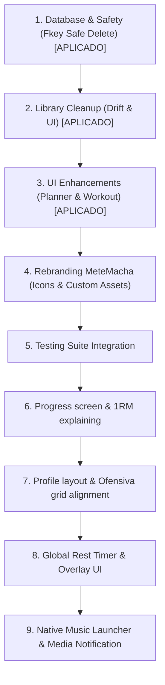

# Relatório de Fatiamento de Commits — MeteMacha 🏋️ (Versão 3)

Este documento apresenta a estratégia completa de fatiamento dos seus arquivos modificados em **9 commits lógicos e incrementais**. Esta abordagem garante que o histórico de desenvolvimento no Git seja limpo, fácil de revisar e mantenha uma aparência orgânica de evolução do código antes de colocar o aplicativo (a terceira versão) no ar.

---

## 🗺️ Visão Geral dos Commits

Os commits 1, 2 e 3 já foram aplicados à sua branch local `main`. Os commits de 4 a 9 representam as alterações pendentes no seu diretório de trabalho.



---

## 🛠️ Guia de Commits Passo a Passo

### 🟢 Commits Já Realizados (Histórico)

#### Commit 1: Database Setup & Safety (Aplicado)
* **Mensagem:** `feat(database): adicionar suporte a banco de dados em memória para testes e ajustar exclusão de splits`
* **Descrição:** Adicionou o construtor `forTesting` no banco de dados e ajustou a exclusão segura de splits removendo dependências da agenda semanal (`weekly_schedules`).

#### Commit 2: Library Cleanup Feature (Aplicado)
* **Mensagem:** `feat(database): implementar limpeza de exercícios não utilizados e checkbox na importação`
* **Descrição:** Adicionou o método `deleteUnusedExercises` e o checkbox correspondente ao importar rotinas.

#### Commit 3: UI Enhancements (Planner & Workout) (Aplicado)
* **Mensagem:** `refactor(ui): melhorar layout do planejador semanal e otimizar usabilidade de inputs no treino`
* **Arquivos:**
  * [lib/pages/setup/setup_page.dart](file:///home/jandersongustavo/Documentos/Projetos/gym/lib/pages/setup/setup_page.dart)
  * [lib/pages/workout/workout_page.dart](file:///home/jandersongustavo/Documentos/Projetos/gym/lib/pages/workout/workout_page.dart)
* **Descrição:** Refatora a interface do planejador semanal substituindo o contêiner de rolagem por um `Wrap` responsivo e adicionando botões de exclusão de dia. Otimiza a entrada de séries/cargas no treino com tooltips de incremento/decremento e prevenção de valores negativos.

---

### 🟡 Commits Pendentes (Diretório de Trabalho)

#### Commit 4: Rebranding MeteMacha (Icons & Custom Assets)
* **Mensagem:** `style(branding): renomear aplicativo para MeteMacha e repaginar tela inicial com animações`
* **Arquivos:**
  * [lib/main.dart](file:///home/jandersongustavo/Documentos/Projetos/gym/lib/main.dart)
  * [pubspec.yaml](file:///home/jandersongustavo/Documentos/Projetos/gym/pubspec.yaml)
  * [pubspec.lock](file:///home/jandersongustavo/Documentos/Projetos/gym/pubspec.lock)
  * [README.md](file:///home/jandersongustavo/Documentos/Projetos/gym/README.md)
  * [LICENSE](file:///home/jandersongustavo/Documentos/Projetos/gym/LICENSE)
  * [lib/pages/splash/splash_page.dart](file:///home/jandersongustavo/Documentos/Projetos/gym/lib/pages/splash/splash_page.dart)
  * [assets/metemacha_app_icon.svg](file:///home/jandersongustavo/Documentos/Projetos/gym/assets/metemacha_app_icon.svg)
  * [assets/metemacha_standalone_icon.svg](file:///home/jandersongustavo/Documentos/Projetos/gym/assets/metemacha_standalone_icon.svg)
  * Android mipmap icons (`android/app/src/main/res/mipmap-*`)
  * Web icons (`web/favicon.png`, `web/icons/`, `web/index.html`, `web/manifest.json`)
* **Descrição:** Aplica toda a nova identidade visual "MeteMacha". Substitui a tela de splash padrão por um layout moderno de alto contraste com efeito vibrante de clique ("METE MARCHA!"). Atualiza os metadados do app e ícones nativos.
* **Comandos Git:**
  ```bash
  git add lib/main.dart pubspec.yaml pubspec.lock README.md LICENSE
  git add lib/pages/splash/splash_page.dart
  git add assets/metemacha_app_icon.svg assets/metemacha_standalone_icon.svg
  git add android/app/src/main/res/mipmap-*
  git add web/favicon.png web/icons/ web/index.html web/manifest.json
  git commit -m "style(branding): renomear aplicativo para MeteMacha e repaginar tela inicial com animações"
  ```

---

#### Commit 5: Testing Suite Integration
* **Mensagem:** `test: adicionar testes de integração de rotinas, exclusão de splits e limpeza de banco de dados`
* **Arquivos:**
  * [test/database_flow_test.dart](file:///home/jandersongustavo/Documentos/Projetos/gym/test/database_flow_test.dart)
  * [test/widget_test.dart](file:///home/jandersongustavo/Documentos/Projetos/gym/test/widget_test.dart)
* **Descrição:** Adiciona testes robustos sobre a integridade do banco de dados, fluxo de importação da rotina ABC e descarte seguro de splits orfãos.
* **Comandos Git:**
  ```bash
  git add test/database_flow_test.dart test/widget_test.dart
  git commit -m "test: adicionar testes de integração de rotinas, exclusão de splits e limpeza de banco de dados"
  ```

---

#### Commit 6: Progress Screen & 1RM Explanation
* **Mensagem:** `feat(progress): reformular tela de evolução, gráficos de músculos e explicação de 1RM`
* **Arquivos:**
  * [lib/pages/progress/progress_page.dart](file:///home/jandersongustavo/Documentos/Projetos/gym/lib/pages/progress/progress_page.dart)
  * [lib/core/providers/progress_extended_provider.dart](file:///home/jandersongustavo/Documentos/Projetos/gym/lib/core/providers/progress_extended_provider.dart)
  * [lib/widgets/weekly_weight_banner.dart](file:///home/jandersongustavo/Documentos/Projetos/gym/lib/widgets/weekly_weight_banner.dart)
* **Descrição:** Cria uma tela de estatísticas contendo estimativa de força máxima 1RM e volumes de treinamento organizados por grupos musculares com gráficos do `fl_chart`. Adiciona toasts explicativos ao tocar nas fórmulas de cálculo (1RM, estimativas) e corrige problemas de transbordo (pixel overflows) na caixa de busca e filtros de exercícios.
* **Comandos Git:**
  ```bash
  git add lib/pages/progress/progress_page.dart lib/core/providers/progress_extended_provider.dart lib/widgets/weekly_weight_banner.dart
  git commit -m "feat(progress): reformular tela de evolução, gráficos de músculos e explicação de 1RM"
  ```

---

#### Commit 7: Profile Layout & Ofensiva Alignment
* **Mensagem:** `feat(profile): alinhar ofensiva e evolução ao grid do perfil do usuário`
* **Arquivos:**
  * [lib/pages/profile/profile_page.dart](file:///home/jandersongustavo/Documentos/Projetos/gym/lib/pages/profile/profile_page.dart)
  * [lib/pages/home/home_page.dart](file:///home/jandersongustavo/Documentos/Projetos/gym/lib/pages/home/home_page.dart)
* **Descrição:** Alinha o contador de "Ofensiva" (semanas seguidas de treino) e o indicador de "Evolução" (% de variação de peso) ao grid do perfil de usuário em duas colunas elegantes de cards. Exibe também o fogo da ofensiva ao lado do título do app na tela inicial.
* **Comandos Git:**
  ```bash
  git add lib/pages/profile/profile_page.dart lib/pages/home/home_page.dart
  git commit -m "feat(profile): alinhar ofensiva e evolução ao grid do perfil do usuário"
  ```

---

#### Commit 8: Global Rest Timer & Overlay UI
* **Mensagem:** `feat(timer): adicionar cronômetro de descanso global e overlay interativo`
* **Arquivos:**
  * [lib/core/providers/rest_timer_provider.dart](file:///home/jandersongustavo/Documentos/Projetos/gym/lib/core/providers/rest_timer_provider.dart)
  * [lib/core/widgets/global_rest_timer_overlay.dart](file:///home/jandersongustavo/Documentos/Projetos/gym/lib/core/widgets/global_rest_timer_overlay.dart)
* **Descrição:** Desenvolve o cronômetro de descanso persistente que é acionado ao concluir séries e permite navegar pelo app sem perder a contagem, exibindo um painel flutuante ("Overlay") com opções para pausar, adicionar ou pular tempo de descanso.
* **Comandos Git:**
  ```bash
  git add lib/core/providers/rest_timer_provider.dart lib/core/widgets/global_rest_timer_overlay.dart
  git commit -m "feat(timer): adicionar cronômetro de descanso global e overlay interativo"
  ```

---

#### Commit 9: Native Music Launcher & Media Notification
* **Mensagem:** `feat(music): integrar rádio de treino com reprodutor nativo e notificações de mídia`
* **Arquivos:**
  * [android/app/build.gradle.kts](file:///home/jandersongustavo/Documentos/Projetos/gym/android/app/build.gradle.kts)
  * [android/app/src/main/AndroidManifest.xml](file:///home/jandersongustavo/Documentos/Projetos/gym/android/app/src/main/AndroidManifest.xml)
  * [android/app/src/main/kotlin/com/example/gym/MainActivity.kt](file:///home/jandersongustavo/Documentos/Projetos/gym/android/app/src/main/kotlin/com/example/gym/MainActivity.kt)
  * [lib/core/services/notification_service.dart](file:///home/jandersongustavo/Documentos/Projetos/gym/lib/core/services/notification_service.dart)
  * [lib/core/services/notification_service_stub.dart](file:///home/jandersongustavo/Documentos/Projetos/gym/lib/core/services/notification_service_stub.dart)
  * [lib/core/services/notification_service_web.dart](file:///home/jandersongustavo/Documentos/Projetos/gym/lib/core/services/notification_service_web.dart)
  * [lib/core/services/notification_service_native.dart](file:///home/jandersongustavo/Documentos/Projetos/gym/lib/core/services/notification_service_native.dart)
  * [assets/images/spotify.png](file:///home/jandersongustavo/Documentos/Projetos/gym/assets/images/spotify.png)
  * [assets/images/ytmusic.png](file:///home/jandersongustavo/Documentos/Projetos/gym/assets/images/ytmusic.png)
  * [assets/images/deezer.png](file:///home/jandersongustavo/Documentos/Projetos/gym/assets/images/deezer.png)
  * [assets/images/samsung_music.png](file:///home/jandersongustavo/Documentos/Projetos/gym/assets/images/samsung_music.png) *(Logomarca Oficial Pink/Magenta)*
  * [assets/images/mi_music.png](file:///home/jandersongustavo/Documentos/Projetos/gym/assets/images/mi_music.png)
  * [assets/images/generic_player.png](file:///home/jandersongustavo/Documentos/Projetos/gym/assets/images/generic_player.png)
  * [assets/sounds/synthwave.mp3](file:///home/jandersongustavo/Documentos/Projetos/gym/assets/sounds/synthwave.mp3) *(Instrumental Synthwave Loop)*
  * [assets/sounds/lofi.mp3](file:///home/jandersongustavo/Documentos/Projetos/gym/assets/sounds/lofi.mp3) *(Instrumental Lofi Beats Loop)*
  * [assets/sounds/rock.mp3](file:///home/jandersongustavo/Documentos/Projetos/gym/assets/sounds/rock.mp3) *(Instrumental Rock Loop)*
  * [.vscode/launch.json](file:///home/jandersongustavo/Documentos/Projetos/gym/.vscode/launch.json)
* **Descrição:** Adiciona a Rádio de Treino integrada na página de treinos, fornecendo botões e links de navegação para os tocadores de música mais populares (Spotify, YT Music, Deezer, Samsung Music, Mi Music ou um pacote customizado). Inclui:
  1. Criação do canal nativo (`com.example.gym/app_launcher`) em Kotlin para disparar os intents de forma limpa e contornar restrições de visibilidade de pacotes do Android 11+.
  2. Inclusão dos logos oficiais de marca locais (incluindo o logo oficial rosa/magenta da Samsung Music).
  3. Controles em background integrados à notificação do celular (`showsUserInterface: true`) para ligar/desligar a rádio com segurança de threads.
  4. Integração de 3 loops de áudio locais (gravados diretamente em assets/sounds) para reprodução offline e instantânea nas rádios de Synthwave, Lofi e Rock, configurando reprodução em repetição infinita (loop).
* **Comandos Git:**
  ```bash
  git add android/app/build.gradle.kts
  git add android/app/src/main/AndroidManifest.xml
  git add android/app/src/main/kotlin/com/example/gym/MainActivity.kt
  git add lib/core/services/notification_service.dart
  git add lib/core/services/notification_service_stub.dart
  git add lib/core/services/notification_service_web.dart
  git add lib/core/services/notification_service_native.dart
  git add assets/images/
  git add assets/sounds/synthwave.mp3 assets/sounds/lofi.mp3 assets/sounds/rock.mp3
  git add .vscode/launch.json
  git commit -m "feat(music): integrar rádio de treino com reprodutor nativo, arquivos offline e notificações de mídia"
  ```

---

## 💡 Dicas Úteis para o Git

1. **Testar antes de Commitar:**
   Antes de começar o processo, você pode executar os testes para garantir que tudo compila e passa normalmente:
   ```bash
   flutter test
   ```
2. **Visualizar o que resta:**
   Use o comando abaixo entre os commits para checar o status atual das modificações que ainda não foram salvas:
   ```bash
   git status
   ```
3. **Descartar algo por engano:**
   Caso decida resetar o status de staging para refazer algum passo, basta usar:
   ```bash
   git restore --staged <caminho_do_arquivo>
   ```
